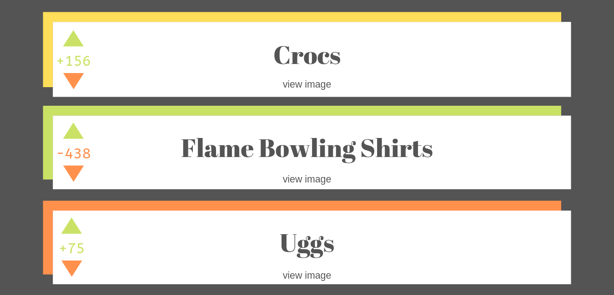

# TRENDi

TRENDi is an app that allows users to post trends in their area, view the top trends by state, and upvote and downvote trends others have posted.

link to live site: https://trendi-app.herokuapp.com/

## Collaborators
Brooke Kennison - (https://github.com/brookelkennison)

Danielle Walraven - (https://github.com/dwalraven21)

## Wireframes





## Challenges

One of our biggest challenges was allowing users to click a state on the map to show only trends from that state. We acomplished this by creating a variable called location that would take the name of the event target (the clicked state). We then did a get request for all data where location matched this state. Finally we reset the posts in state to be the new list of only posts that were retrieved from this GET request. 

```JavaScript
mapHandler = (event) => {

	let location = event.target.dataset.name
	// console.log(location);
	fetch(`/api/posts/${location}`, {
		method: 'GET',
		headers: {
			'Accept': 'application/json, text/plain, */*',
			'Content-Type': 'application/json'
		}
	})
	.then(data => data.json())
	.then(jData => {
		this.setState({ posts: [jData] })

	})

};

```
Here is the show route we created in our posts model:

```Ruby
# show
  def self.find(location)
    # query to find the posts
    results = DB.exec("SELECT * FROM posts WHERE location='#{location}' ORDER BY rank DESC;")
	return results.map do |result|
      {
          "id" => result["id"].to_i,
          "name" => result["name"],
          "location" => result["location"],
          "image" => result["image"],
	  "rank" => result["rank"].to_i
      }
    end
  end
```

Another challenge was allowing the users to update the rank of each item by upvoting or downvoting. Here is how we acomplished this. We created a function that takes for parameters the index of the item we are updating and the delta or difference we want the rank to change.
In setState we created two variables: updatedPosts, to contain our current array and updatedPost, to contain the item we want to update.
We can now add the delta to the current post's rank. To make sure this change persists and actually updates in the database, we called our handleUpdate function, passing in the updatedPost.

```JavaScript
 handleRankChange = (index, delta) => {
	this.setState( prevState => {
		// console.log(prevState);
		// new array - copy of previous posts array
		const updatedPosts = [ ...prevState.posts ];
		// a copy of the post we are targeting
		const updatedPost = updatedPosts[index];

		// Update the target post's rank
		updatedPost.rank += delta;

		// Update the posts array with the target post's new rank
		updatedPosts[index] = updatedPost;

		this.handleUpdate(updatedPost);

	})
}

```
Here's our handleUpdate function for reference.

```JavaScript
 handleUpdate = (updateData) => {
	  fetch(`/api/posts/${updateData.id}`, {
		  body: JSON.stringify(updateData),
		  method: 'PUT',
		  headers: {
			'Accept': 'application/json, text/plain, */*',
			'Content-Type': 'application/json'
		  }
	  })
	  .then(updatedPost => {
		// call this.fetchPosts to show the updated post immediately
		this.fetchPosts()
	  })
	  .catch(err => console.log(err))
  }
```
Here's where the function is being called. When the user clicks the up arrow the handleRankChange function is being passed the item index and the integer 1, when the user clicks the down arrow, it is passed -1, so the rank will decrease by 1.

We also added a ternary operator to change the class of the rank number if it was positive or negative.
```JavaScript
<ul className="vote">
	<li className="upvote" onClick={() => {this.props.handleRankChange(this.props.index, 1);}}>&#9650;</li>
	{this.props.postData.rank > 0 ?
	<li className="upvote">{this.props.postData.rank}
	</li>
	:<li className="downvote">{this.props.postData.rank}
	</li>}
	<li className="downvote" onClick={() => {this.props.handleRankChange(this.props.index, -1);}}>&#9660;</li>
</ul>
```

## Improvements

One improvement we would like to make is to have a login page for moderators. Users could then make requests to have trends removed, but moderators would be the only ones with permission to actually remove the trends. This would allow the ability to remove inappropriate submissions, but also protect the data from being deleted by anyone who decides they want to remove it.

## Deployment

Deployed with Heroku

## Tech/frameworks used

* Ruby on Rails
* React
* postgreSQL
* HTML
* CSS
* JavaScript

## Acknowledgments

The interactive svg map was taken from a react package, maintained by Gabriela D'Ávila Ferrara. It can be found here:
https://www.npmjs.com/package/react-usa-map
